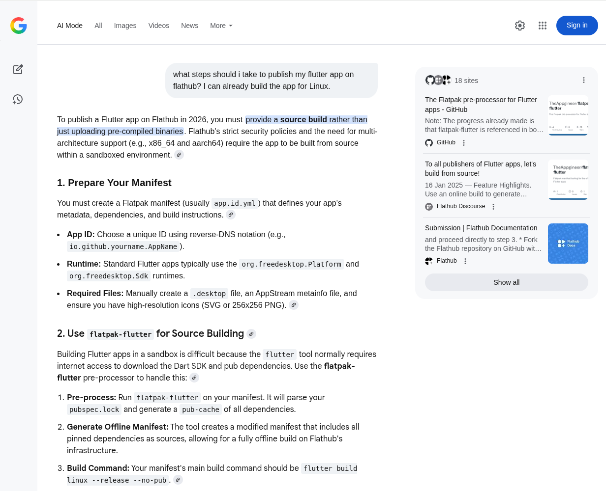
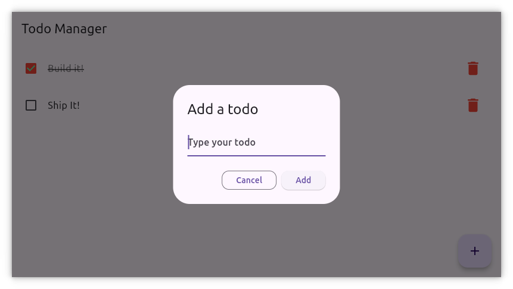

# flatpak-flutter
The Flatpak pre-processor for Flutter apps

## Project Goal
The goal of the flatpak-flutter project is to simplify the publishing of Flutter based Linux apps on Flathub.

## Project Achievements
The project is now running for a year, and the flatpak-flutter achievements so far are:

* Referenced in both the [Flatpak](https://github.com/flatpak/flatpak-builder-tools?tab=readme-ov-file#flutter) and [Flutter](https://docs.flutter.dev/deployment/linux#additional-deployment-resources) documentation.
* Has become the de facto standard for FOSS Flutter apps, as Flathub is enforcing the [building from source](https://docs.flathub.org/docs/for-app-authors/requirements#building-from-source) and [no network access during build](https://docs.flathub.org/docs/for-app-authors/requirements#no-network-access-during-build) requirements for new submissions.
* Used by a [growing list](#apps-published-using-flatpak-flutter) of apps.
* Gets found by developers, as it is know by Search and AI Chatbots.

<br>


## The Flathub vs Flutter Status Quo
When a Flutter app is ready for publishing on Flathub then, as part of the PR, the manifest gets build on Flathub infra. At the time the build reaches the first use of the `flutter` tool, it tries to download the Dart SDK and fails in the sandboxed build environment for [lack of online access](https://docs.flathub.org/docs/for-app-authors/requirements#no-network-access-during-build).

For both the Flathub and Flutter project there have been requests to change behavior, but these requests get low priority or are not in line with project policy, keeping the status quo. This limits the options for developers. A Flutter developer who want to publish for Linux is more likely to use Snaps, as that is the supported and documented solution:

https://docs.flutter.dev/deployment/linux

Let's get to a more equal playing field!

### The Common Approach
The approach often taken by Flutter app developers to get their apps published on Flathub, is to create an archive with pre-built binaries and download that within the app manifest. This can lead to the recurring question during the PR review process of "Why not build from source?", but when the reviewer gets aware of the Fluter nature of the app it used to get accepted.

> Note: Recently the submission policy of Flathub has become more strict. For open source applications a source build is expected, for traceability and security reasons. Also because it is now known that Flutter apps can be built from source.

### The flatpak-flutter Approach
flatpak-flutter performs a pre-processing run on the app manifest to collect all the required sources for an offline build and stores their origins in the form of flatpak-builder `modules` and `sources`. The output of this pre-processing step is a manifest that can be built in a sandboxed environment, which can be verified locally by running `flatpak-builder` with the `--sandbox` option.

### Why Build From Source?
With the approach of pre-built binaries it is not certain that the local build used the same library versions as included in the Flatpak Runtime, this can cause compatibility issues.

An added benefit of the source build is that both the x86_64 and aarch64 architecture will be built on the Flathub infra. No longer the need to skip aarch64 support in the `flathub.json` file.

Last but not least it is also in line with [Flathub requirements](https://docs.flathub.org/docs/for-app-authors/requirements#building-from-source).

## The flatpak-flutter Workflow
What better way to demonstrate the tool then by building a TODO app :)



This workflow chapter uses the `com.example.todo` directory included in the git repository. The `flatpak-flutter.yml` file can be used as an example.

> Note: The TODO app is an unmodified [3th party app](https://github.com/5minslearn/Flutter-Todo-App).

### Create the Manifest
As is the case for every Flatpak, it all starts with the manifest file, but flatpak-flutter eases some criteria to deal with Flutter apps.

> Note: It is recommended to name the manifest `flatpak-flutter.{yml,yaml,json}`, to differentiate it from the generated manifest named after the app-id.

#### Modules
* Name the main module after the app name in the app id
  ```yml
  modules:
    - name: todo
  ```
* Use build system simple
  ```yml
      buildsystem: simple
  ```

> Note: If the main module name differs from the app name, then it be specified via the `--app-module` command line option.

#### Build Commands
* Use the Flutter build command, as if it is a local build
  ```yml
      build-commands:
        - flutter build linux --release --no-pub
  ```
* Add the other commands to install the app and metadata

#### Sources
* Add the git repository of the app
  ```yml
      sources:
        - type: git
          url: https://github.com/5minslearn/Flutter-Todo-App.git
          commit: 2a98e745969dd657efe2eccd964253cd20d13e25
  ```
* Add the git repository of Flutter, use the tag that the app needs
  ```yml
        - type: git
          url: https://github.com/flutter/flutter.git
          tag: 3.38.5
          dest: flutter
  ```
* Add any other dependencies

If the app repository itself has the flutter repository as a submodule, then the `flutter` source is not needed. The `.gitmodules` file will be searched for the location of the Flutter SDK, the branch has to be set to `stable`.

### Pre-process With flatpak-flutter
By passing the manifest to flatpak-flutter it will collect all the dependency sources and generate the manifest for the offline build, to be performed by flatpak-builder. This process pins each dependency to a specific revision, ensuring a reproducible build.

```sh
cd com.example.todo
../flatpak-flutter.py flatpak-flutter.yml
```

> Note: The above generation process only has to be repeated if app dependencies change, or have updates.

#### Conversion steps taken
The conversion steps taken on the manifest, to come to the offline manifest, are:

* The `git` entry for flutter is replaced with the matching SDK module, based on the specified tag
* The PATH is adjusted to include the Flutter SDK for the offline build
* The command to activate the SDK (`setup-flutter.sh`) is inserted in the `build-commands`
* The `pubspec-sources.json` manifest is appended to the `sources`

For Rust dependencies some additional steps are taken:

* The `cargo-sources.json` manifest is appended to the `sources`
* The `rustup-<version>.json` module is appended to the `modules`


#### Command line options
```
$ ./flatpak-flutter.py --help
usage: flatpak-flutter.py [-h] [-V] [--app-module NAME] [--app-pubspec PATH]
                          [--extra-pubspecs PATHS] [--cargo-locks PATHS]
                          [--from-git URL] [--from-git-branch BRANCH]
                          [--no-shallow-clone] [--keep-build-dirs]
                          MANIFEST

positional arguments:
  MANIFEST              Path to the manifest

options:
  -h, --help            show this help message and exit
  -V, --version         show program's version number and exit
  --app-module NAME     Name of the app module in the manifest
  --app-pubspec PATH    Path to the app pubspec
  --extra-pubspecs PATHS
                        Comma separated list of extra pubspec paths
  --cargo-locks PATHS   Comma separated list of Cargo.lock paths
  --from-git URL        Get input files from git repo
  --from-git-branch BRANCH
                        Branch to use in --from-git
  --no-shallow-clone    Don't use shallow clones when mirroring git repos
  --keep-build-dirs     Don't remove build directories after processing
```

#### Foreign code
If the app makes use of foreign code, like C/C++ or Rust, then instead of specifying `--extra-pubspecs` and `--cargo-locks` on the command line, a (source controlled) `foreign.json` file can be used instead. Independent code parts can be separated and named for readability/maintainability.

Below is an example file from a [flutter_rust_bridge](https://pub.dev/packages/flutter_rust_bridge) based app.

```json
{
    "rust_lib": {
        "cargo_locks": [
            "rust"
        ],
        "extra_pubspecs": [
            "rust_builder/cargokit/build_tool"
        ],
        "manifest": {
            "sources": [
                {
                    "type": "patch",
                    "path": "cargokit/run_build_tool.sh.patch",
                    "dest": "rust_builder/cargokit"
                }
            ]
        }
    }
}
```

### Build With flatpak-builder
The generated manifest can now to passed to flatpak-builder, to verify correctness.

```sh
flatpak-builder --repo=repo --force-clean --sandbox --user --install --install-deps-from=flathub build com.example.todo.yml
```

> Note: Or use `flatpak run org.flatpak.Builder` instead of `flatpak-builder`.

### Submit to Flathub
With a manifest suitable for a sandboxed build, the [Flathub Submission](https://docs.flathub.org/docs/for-app-authors/submission) can take place.

## Tackling a Failing Build
Not every app will build right away, dependencies can still assume online access.

### Perform an Online Build
A first step in fixing build issues is to verify the build with online access. For this the network permission has to be temporarily added to the `flatpak-flutter.yml` file.

```yml
      buildsystem: simple
      build-options:
        build-args:
          - --share=network
```

Additionally, the online build has to be done without the `--no-pub` option.

```yml
      build-commands:
        - flutter build linux --release
```

The build has to be performed on the `flatpak-flutter.yml` manifest, without the `--sandbox` option of `flatpak-builder`.

### Build Verbose
Perform a verbose build to further investigate the failure.

```yml
      build-commands:
        - flutter build linux --release --no-pub --verbose
```

### Deal with Foreign Dependencies
Some Dart packages, coming from pub.dev, are wrappers around C/C++ or Rust code. The build process of such a dependency can still try to download a resource. This behavior cannot be known upfront based on the `pubspec.lock` file. If the verbose build log shows a download attempt, then this download has to be added to the `sources` in the manifest. For Rust dependencies, that make use of cargo, the `Cargo.lock` file can be specified with the `--cargo-locks` command line option, or with a [foreign.json](#foreign-code) file.

Known foreign dependencies are described in the `foreign-deps/foreign-deps.json` file, these are automatically handled by flatpak-flutter. In the case of Rust dependencies a `rustup-<version>.json` module is generated, providing a recent toolchain. If a specific version is required then this can be done by specifying the module in the `flatpak-flutter.yml` file.

### Report an Issue
If build issues remain then [an issues](https://github.com/TheAppgineer/flatpak-flutter/issues) can be opened.

## Setup
### Docker
The recommended setup is to use the Docker image.

    docker run --rm -v "$PWD":/usr/src/flatpak -u `id -u`:`id -g` theappgineer/flatpak-flutter:latest

An alias can be defined to get a clean command line (`.bashrc`):

    alias flatpak-flutter='docker run --rm -v "$PWD":/usr/src/flatpak -u `id -u`:`id -g` theappgineer/flatpak-flutter:latest'

Basic usage:

    flatpak-flutter flatpak-flutter.yml

### Python
flatpak-flutter requires Python 3.8 or later.

Poetry users:
run `poetry install` to setup, activate your virtual env by running `poetry shell`.

Otherwise install Python 3.8+ and the dependency packages:

    pip install packaging pyyaml tomlkit

Or, using the requirements file:

    pip install -r requirements.txt

## Python module details
The Python modules, taking care of the different processing steps, are further
described in the README file within the module subdirectory:

* [flutter_sdk_generator](flutter_sdk_generator/README.md)
* [pubspec_generator](pubspec_generator/README.md)

> Note: The modules can be executed stand-alone from the command line, use `python3 <module>.py --help` for the specifics.

## Apps Published Using flatpak-flutter

* [Al-Quran - Simple](https://flathub.org/en/apps/io.github.meypod.al-quran)
* [AstroGods](https://flathub.org/en/apps/it.astrogods.AstroGods)
* [Brisk](https://flathub.org/apps/io.github.BrisklyDev.Brisk)
* [Chameleon Ultra GUI](https://flathub.org/apps/run.chameleon.chameleonultragui)
* [CloudOTP](https://flathub.org/apps/com.cloudchewie.cloudotp)
* [Community Remote](https://flathub.org/apps/com.theappgineer.community_remote)
* [Gopeed](https://flathub.org/apps/com.gopeed.Gopeed)
* [Lotti](https://flathub.org/en/apps/com.matthiasn.lotti)
* [Mapiah](https://flathub.org/apps/io.github.rsevero.mapiah)
* [NoMoreBackground](https://flathub.org/en/apps/com.adilhanney.no_more_background)
* [Outlet](https://flathub.org/apps/io.github.jardon.Outlet)
* [Passy](https://flathub.org/apps/io.github.glitterware.Passy)
* [Ricochlime](https://flathub.org/en/apps/com.adilhanney.ricochlime)
* [Saber](https://flathub.org/en/apps/com.adilhanney.saber)
* [Sly](https://flathub.org/apps/page.kramo.Sly)
* [Table Habit](https://flathub.org/apps/io.github.friesi23.mhabit)
* [Timing Trainer](https://flathub.org/en/apps/com.adilhanney.timing)
* [TowDow](https://flathub.org/en/apps/app.towdow.TowDow)
* [UnifiedPush Troubleshooter](https://flathub.org/en/apps/org.unifiedpush.Troubleshooter)
* [wger](https://flathub.org/apps/de.wger.flutter)
* Your app here?

> Note: Please get in contact if you know about an app using flatpak-flutter that is not on this list!
